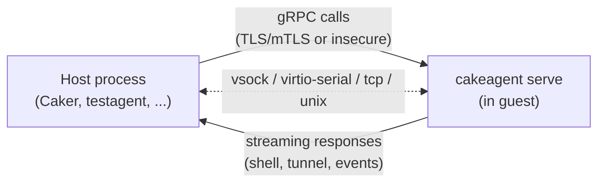

# cakeagent

[](https://github.com/Fred78290/cakeagent/actions/workflows/release.yaml)
[](LICENSE)

**cakeagent** is a lightweight gRPC agent that runs *inside* a virtual machine and exposes guest-management operations to the outside world: system telemetry, command execution, an interactive shell/TTY, VirtioFS mounting, disk resizing, graceful shutdown, and TCP/UDP network tunneling / port-forwarding.

It is the guest-side counterpart installed and driven by the [Caker](https://github.com/Fred78290/caker) project, which uses it to remotely control and introspect the VMs it manages — but the gRPC contract is generic enough to be used by any host-side client, and a reference client (`testagent`) is included.

## How it works



- The agent binds a **gRPC server** inside the guest and the host connects to it over one of several transports (see [Transports](#transports--addressing)).
- Every RPC is defined once, in [`proto/agent.proto`](proto/agent.proto), and implemented twice — once in Go, once in Swift — so host tooling gets identical behavior regardless of the guest OS.
- Optional mutual TLS secures the channel; an insecure mode is available for local development.

## Two implementations, one contract

| Platform | Language | Entry point | Role |
|---|---|---|---|
| Linux guests | Go | [`linux/main.go`](linux/main.go) → `cakeagent` | Primary Linux agent, built for `linux/amd64` and `linux/arm64` |
| macOS guests | Swift | `darwin/Sources/CakeAgent` → `cakeagent` | Primary macOS agent (code-signed, notarized, shipped as a universal binary / `.pkg`) |
| Client library | Swift | `darwin/Sources/CakeAgentLib` | Shared gRPC client used by `testagent` and by host tooling |
| Reference client | Swift | `darwin/Sources/TestAgent` → `testagent` | CLI used to exercise every RPC against either agent implementation |

Both agents implement the same `CakeAgentService` gRPC contract, so a host can talk to a Linux or macOS guest the same way.

## Features (gRPC surface)

Defined in [`proto/agent.proto`](proto/agent.proto):

| RPC | Kind | Purpose |
|---|---|---|
| `Ping` | unary | Connectivity check / round-trip latency |
| `Info` | unary | Memory, disk, per-core CPU, network, OS/host, process count |
| `CurrentUsage` | server-streaming | Live CPU/memory usage sampled at a given frequency |
| `Run` | unary | Execute a command, return exit code + stdout/stderr once complete |
| `Execute` | bidi-streaming | Interactive shell/TTY session with resizable terminal, streamed input/output |
| `Mount` / `Umount` | unary | Mount/unmount VirtioFS shares by name, target, uid/gid, read-only, early-boot |
| `ResizeDisk` | unary | Grow the guest disk to use all available space |
| `Shutdown` | unary | Gracefully power off the guest |
| `Tunnel` | bidi-streaming | Bidirectional TCP/UDP tunnel between host and guest network |
| `Events` | server-streaming | Stream of tunnel port-forward add/remove events |

## Transports & addressing

The `--listen` / `--connect` address is a URL whose scheme selects the transport:

| Scheme | Example | Notes |
|---|---|---|
| `vsock` | `vsock://any:5000`, `vsock://host:5000`, `vsock://<cid>:5000` | Default. `any`/`host`/`hypervisor` are well-known context IDs; otherwise a numeric CID |
| `virtio` | `virtio://<port-name>` | Listens on `/dev/virtio-ports/<port-name>` (virtio-serial), used when vsock isn't available |
| `tcp` | `tcp://127.0.0.1:5010` | Plain TCP, mainly for local development |
| `unix` | `unix:///path/to/agent.sock` | Unix domain socket |

Security: pass `--ca-cert`, `--tls-cert` and `--tls-key` to require mutual TLS; omit them (or pass `--insecure` on the Swift client) to run without transport security — intended for local/dev use only.

## Repository layout

- [`Package.swift`](Package.swift) — SwiftPM manifest, products `cakeagent`, `testagent`, `CakeAgentLib`
- [`darwin/Sources/CakeAgent`](darwin/Sources/CakeAgent) — Swift agent server (macOS)
- [`darwin/Sources/CakeAgentLib`](darwin/Sources/CakeAgentLib) — shared gRPC client library
- [`darwin/Sources/TestAgent`](darwin/Sources/TestAgent) — `testagent` gRPC test CLI
- [`darwin/Tests`](darwin/Tests) — Swift unit tests
- [`linux/main.go`](linux/main.go) — Go CLI and agent server (Linux)
- [`linux/pkg`](linux/pkg) — server implementation: `cakeagent` gRPC service, `mount`, `tunnel`, `resize`, `serialport`, `event`, `utils`
- [`linux/service`](linux/service) — OS service installation (systemd/OpenRC on Linux, launchd on Darwin)
- [`linux/console`](linux/console) — PTY/console handling for `Execute`
- [`proto/agent.proto`](proto/agent.proto) — gRPC contract; `proto/generate.sh` regenerates stubs
- [`scripts/`](scripts) — local run scripts for both agents and `testagent`
- [`tests/`](tests) — standalone Go/Swift clients used to validate the RPC surface end-to-end
- [`.ci/`](.ci) — macOS signing, packaging (`.pkg`) and notarization scripts used by the release workflow
- [`_artifacts/`](_artifacts) — build output: `cakeagent-{linux,darwin}-{amd64,arm64}`

## Prerequisites

- macOS 13+ for Darwin builds (Swift 5.10+, via Xcode/Swift toolchain)
- Go 1.26+ for Linux builds (see [`linux/go.mod`](linux/go.mod))
- `protoc` for gRPC stub regeneration

## Build

### Darwin (Swift)

From the repository root:

```bash
swift build
```

Generated binaries:

- `./.build/debug/cakeagent`
- `./.build/debug/testagent`

### Linux (Go)

```bash
cd linux
go build
```

Generated binary:

- `linux/cakeagent`

The Go module also cross-compiles for `darwin/amd64` and `darwin/arm64` (see [`.ci/build.sh`](.ci/build.sh)), but the code-signed, notarized macOS binary shipped in releases is the Swift build.

## Quick start

```bash
./scripts/cakeagent-darwin.sh      # Start Swift agent (TLS)
./scripts/cakeagent-linux.sh       # Start Go agent (TLS)
./scripts/runagent-insecure.sh     # Start Swift agent (insecure)
./scripts/testagent.sh             # Run Swift test client
./scripts/testagent-insecure.sh    # ... against an insecure agent
./scripts/testagent-linux.sh       # ... over a unix socket, against a running VM
```

These scripts expect certificates under `~/.cake/agent/` (`ca.pem`, `server.pem`/`server.key`, `client.pem`/`client.key`) — adjust paths as needed.

## `cakeagent` CLI (Linux / Go)

```
cakeagent
├── serve                                    start the gRPC server
├── version                                  display version information
├── infos [--json]                           display system information
├── cpu-usage [--json]                       display continuous CPU usage
├── ping [message] [--json]                  round-trip ping test
├── mount <name:target[,opts...]>... [--json] mount VirtioFS endpoints
└── service
    ├── install                              install as a system service (systemd/OpenRC) and start it
    ├── remove                               remove the system service
    ├── start                                start the installed service
    └── stop                                 stop the installed service
```

Global flags: `--log-level` (`panic|debug|info|warning|error|fatal`), `--log-format` (`text|json`).

`serve` / `service install` flags:

| Flag | Default | Description |
|---|---|---|
| `--listen` | `vsock://any:5000` | Listen address (see [Transports](#transports--addressing)) |
| `--ca-cert` | — | CA certificate for mTLS |
| `--tls-cert` | — | Server TLS certificate |
| `--tls-key` | — | Server private key |
| `--timeout` | `120s` | Request timeout (`0s` = no timeout) |
| `--tick` | `1s` | Tick event interval |
| `--mount` (`service install` only) | — | Repeatable `name:target[,opts...]` mount to configure at install time |

`mount` string format: `name:target[,uid=X,gid=Y,ro,early]`, e.g.:

```bash
cakeagent mount share:/mnt/share
cakeagent mount data:/data,uid=1000,gid=1000
cakeagent mount config:/etc/config,ro,early share:/mnt/share,uid=1000
```

Example:

```bash
cd linux
./cakeagent serve \
  --listen=tcp://127.0.0.1:5010 \
  --ca-cert="$HOME/.cake/agent/ca.pem" \
  --tls-cert="$HOME/.cake/agent/server.pem" \
  --tls-key="$HOME/.cake/agent/server.key"
```

> Any flag can be set via an environment variable prefixed with `CAKEAGENT_` (e.g. `CAKEAGENT_LISTEN`, `CAKEAGENT_LOG_LEVEL`).

## `cakeagent` CLI (Darwin / Swift)

```
cakeagent
├── serve            start the gRPC server (launchd-managed when installed as a service)
├── version          display version information
├── infos            display system information
├── resize-disk      resize the macOS disk to use all available space
└── service
    ├── install       install as a launchd service
    ├── start         start the installed service
    └── stop          stop the installed service
```

`serve` / `service install` share the same flags as the Go CLI (`--listen`, `--ca-cert`, `--tls-cert`, `--tls-key`, `--log-level`), plus `--insecure` on `service install` to skip TLS.

Help:

```bash
swift run cakeagent --help
swift run cakeagent serve --help
```

## `testagent` CLI (Darwin / Swift)

Reference gRPC client used to exercise the agent from a host machine:

```bash
swift run testagent --help
```

Subcommands: `shell` (interactive TTY via `Execute`), `exec`, `run`, `shutdown`, `infos`, `current` (live CPU usage), `tunnel local`/`tunnel remote` (port forwarding).

## gRPC / Protobuf

The contract is defined in [`proto/agent.proto`](proto/agent.proto).

Stub regeneration:

```bash
cd proto
./generate.sh
```

This orchestrates Go generation (`proto/linux.sh`) and Swift generation (`proto/darwin.sh`).

## Tests

- Swift unit tests: `swift test`
- End-to-end RPC validation clients in [`tests/`](tests) (`test_client.go`, `test_client_swift.swift`, `test_swift_cpu.go`, `test_parser.go`) — standalone modules that exercise a running agent over gRPC.

## CI / Release

- [`.github/workflows/release.yaml`](.github/workflows/release.yaml): on push to `master` or a `v*`/`ci-build` tag, builds the Swift agent (universal binary), the Go agent for `linux`/`darwin` × `amd64`/`arm64`, and — for tagged releases — code-signs, notarizes and packages the macOS binary into a `.pkg` via [`.ci/build.sh`](.ci/build.sh) / [`.ci/create-pkg.sh`](.ci/create-pkg.sh).
- [`.github/workflows/linux.yaml`](.github/workflows/linux.yaml) and [`.cirrus.yml`](.cirrus.yml) provide additional Linux and macOS build coverage.

## License

This project is licensed under **GNU AGPL v3**. See [`LICENSE`](LICENSE).
